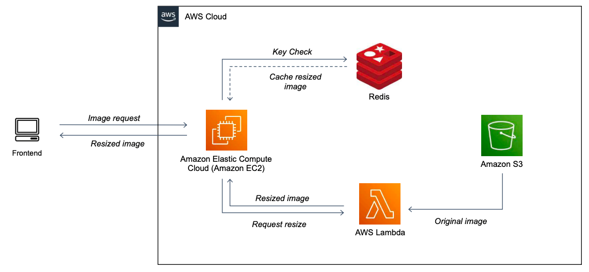

# Lambda_resize_S3_image

AWS Lambda to resize images from S3 bucket using node/sharp

본 문서는 Winder API Server에 적용된 Ondemand Image Resizing 과 contents delevery 를 위한 이미지 캐싱을 왜, 그리고 어떻게 했는지에 대한 내용을 담고 있습니다.

### 참고자료
* [온디맨드 이미지 리사이징 (Ondemand Image Resizing) 원리 및 예제](https://roka88.dev/102)
* [AWS Lambda@Edge에서 실시간 이미지 리사이즈 & WebP 형식으로 변환](https://medium.com/daangn/lambda-edge%EB%A1%9C-%EA%B5%AC%ED%98%84%ED%95%98%EB%8A%94-on-the-fly-%EC%9D%B4%EB%AF%B8%EC%A7%80-%EB%A6%AC%EC%82%AC%EC%9D%B4%EC%A7%95-f4e5052d49f3)

### 목차
1. Ondemand Image Resizing 사용 배경
2. Ondemand Image Resizing Infra
    * Resize - AWS Lambda
    * Cache - Redis
3. Ondemand Image Resizing Process

> ### 1. Ondemand Image Resizing 도입 배경

Winder 서비스 개발 초기 이미지 컨텐츠 전송 방식은 아래와 같은 문제점이 있었고 이를 해결하고자 도입하였습니다.

```text
1. S3 버킷을 public 으로 설정하여 버킷 안의 이미지 url을 제공하여 보여주는 방식
    → S3 버킷 이미지 접근에 대한 제한이 필요해보임.

2. 이미지 별로 다양한 사이즈가 요구되어 각각의 이미지를 사이즈별로 S3에 저장 하는 방식.
    → 사이즈별로 저장해놓는 방식은 새로운 사이즈가 필요할 때 유연하게 대응하기가 어려움. 저장 용량 또한 새로운 사이즈가 필요할 때 마다 기하급수적으로 증가.
    → 서비스 환경 (모바일, 웹, 운영체제 등)에 따라 다양한 이미지 포멧을 지원하기 어려움.

```

> ### 2. Ondemand Image Resizing Infra

레퍼런스를 찾아보았을 때, 이와 같은 인프라를 구축하기 위해 AWS Cloudfront의 CDN과 Lambda edge를 같이 사용하여 캐싱과 라우팅 최적화를 할 수 있어보입니다.

하지만 현재 개발중인 서비스가 비교적 작은 규모의 프로젝트이기에 AWS Cloudfront 대신 EC2에 Redis를 설치하여 캐싱 서버로 사용해 보았습니다.

* #### Resize - AWS Lambda
  AWS lambda는 서버를 프로비저닝하거나 관리하지 않고도 코드를 실행할 수 있게 해주는 컴퓨팅 서비스입니다.

이를 사용했을 시의 장점은 다음과 같았습니다.
```markdown
* 서버와 분리된 환경이다보니 사용하는 언어에 제약이 작다는 점.
    -> 이미지 처리를 node/sharp, python/openCV 두 케이스중 하나로 진행하는 것을 염두에 두었습니다.
    -> 최종적으로는 node/sharp 와 python/openCV 중 sharp가 openCV에 비해 비교적 간단히 적용이 가능하다는 점에 sharp를 채택하여 사용했습니다.

* AWS의 IAM 설정을 통해 S3 버킷에 접근하기 편리하다는 점.
```

* #### Cache - Redis

Redis는 오픈소스이며 in-memory data structure 저장을 지원합니다. 이러한 특징 에 빠른 데이터 읽기/쓰기가 가능하고 데이터베이스, 캐시, 메세지 브로커, 세션관리 등 다양한 용도로 사용이 가능이 가능합니다.

본 구현에서는 인메모리 방식의 장점을 이용하여 Image Resizing에 대한 요청값을 Key로, 이미지 버퍼를 Value로 캐싱하여 요청값을 토대로 캐싱된 값을 바로 response 할 수 있도록 서버를 구현해보았습니다.

> ### 3. Ondemand Image Resizing Process

```
1. 프론트에서 이미지 캐싱 서버의 API 엔드포인트에 원하는 이미지, 사이즈, 확장자를 요청.
2. 이미지 캐싱 서버는 요청값을 토대로 Redis 캐싱여부를 확인한다.
2-A. 캐싱된 이미지가 있다면 해당 이미지를 가져온다. 
2-B. 캐싱된 이미지가 없다면 Lambda에 이미지 리사이징을 요청한다.
    - Lambda -
    1. 요청받은 image path를 통해 aws-sdk는 S3 bucket으로부터 이미지를 가져온다.
    2. 불러온 이미지 데이터를 버퍼에 저장한다. 
    2. 버퍼에 저장된 데이터는 sharp 모듈을 통해 요청받은 사이즈/포멧으로 변경.
    3. resize된 이미지 데이터를 base64 형식으로 변환하여 전송중 손실을 예방하고 수신 서버의 환경에 영향을 받지 않도록한다.
    4. 캐싱 서버에 Base64 인코딩된 데이터를 전송한다.
    5. 캐싱 서버는 이를 Redis에 캐싱한다.
3. resize 된 이미지를 프론트에 응답한다.
```

